## 原始benchmark接口测试
> http://localhost:8080  
> 该部分测试是为评估`fastapi`本身流式与非流式返回的性能,不涉及转发

启动参数: `BENCHMARK_MODE=true aifd run --workers=n --port 8080` (n=1 or 16)


### stream == false:
```bash
wrk -t8 -c400 -d10s -s post.lua http://localhost:8080/benchmark/v1/chat/completions
```
单核:

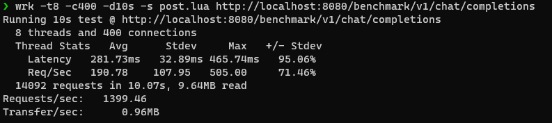


16核:
```bash
wrk -t15 -c500 -d10s -s post.lua http://localhost:8080/benchmark/v1/chat/completions
```
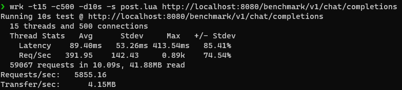

### stream == true:
```bash
wrk -t8 -c100 -d10s -s post.lua http://localhost:8080/benchmark/v1/chat/completions
```
从下面的测试中可以发现，对于fastapi的流式返回时的Request/sec并不高，这里其实还应该添加不同流式返回时间的测试,
目前流式返回的文本在`cache/chat`中, 下面的结果中没有设置`TOKEN_RATE_LIMIT`，可以添加不同的`TOKEN_RATE_LIMIT`进行测试以模拟实际情况。

单核:

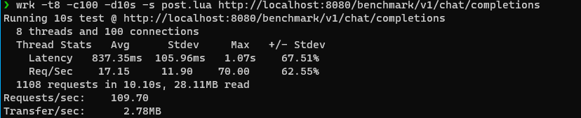


16核:  
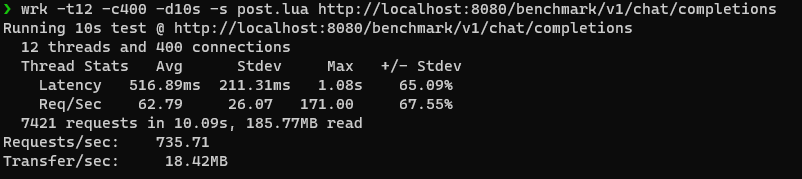


## 转发benchmark接口
> http://localhost:8000  
> 该部分评估流式与非流式转发的性能


启动参数: `OPENAI_BASE_URL=http://localhost:8080 aifd run --workers=n --port 8000` (n=1 or 4)
```bash
wrk -t8 -c100 -d10s -s post.lua http://localhost:8000/benchmark/v1/chat/completions
```

### stream == false:

**单核**

(httpx)  
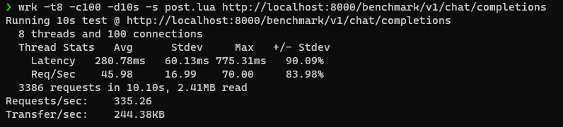

(aiohttp)  
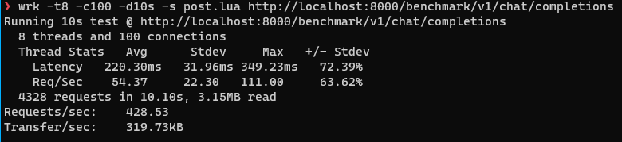

**4核**:

(httpx)  
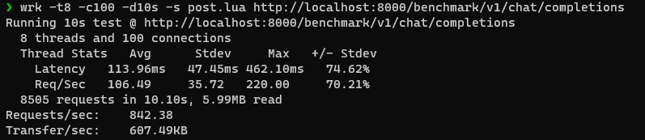

(aiohttp)  
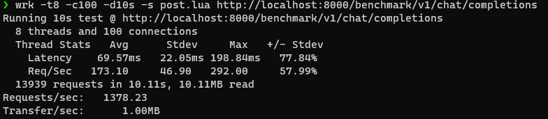

### stream == true:

**单核**: 

(httpx)  
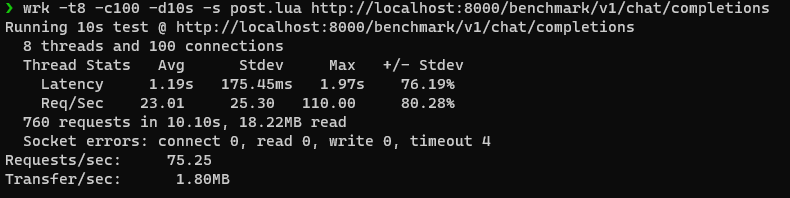

(aiohttp)  
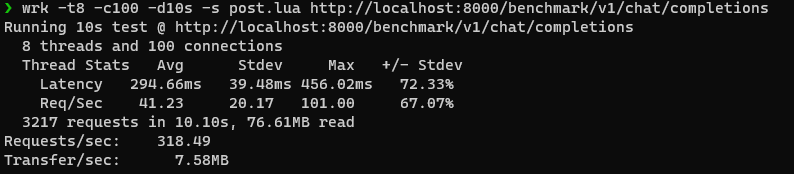

**4核**:

(httpx)  
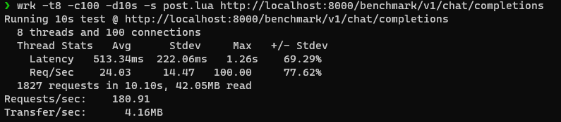

(aiohttp)  
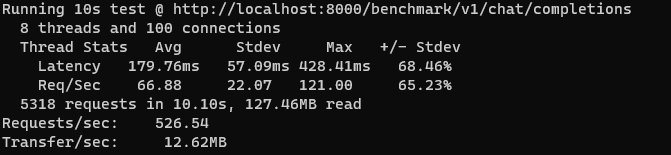


注: 虽然结果显示在流式转发的性能上 aiohttp 要比 httpx 的性能要高很多，
但这主要是代码中aiohttp版本中做了一些优化，此处结果不代表这两个库的实际性能差异。
但aiohttp目前在流式与非流式上的性能比httpx更高是无疑的。

