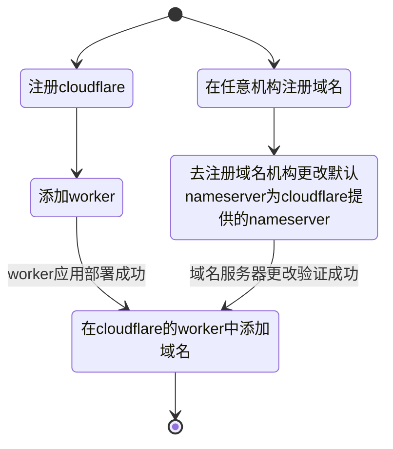

# 部署指南

## pip (推荐)

**安装**

```bash
pip install openai-forward
```

**运行转发服务**  
可通过`--port`指定端口号，默认为`8000`

```bash
openai_forward run --port=9999 
```

服务就搭建完成了，使用方式只需将`https://api.openai.com` 替换为服务所在端口`http://{ip}:{port}` 即可。

当然也可以将 OPENAI_API_KEY 作为环境变量或`--api_key`参数传入作为默认api key， 这样客户端在请求相关路由时可以无需在Header中传入Authorization。
带默认api key的启动方式：

```bash
openai_forward run --port=9999 --api_key="sk-******"
```

注: 如果既存在默认api key又在请求头中传入了api key，则以请求头中的api key会覆盖默认api key.


### 服务调用

替换openai的api地址为该服务的地址即可，如：

```bash
https://api.openai.com/v1/chat/completions
```

替换为

```bash
http://{ip}:{port}/v1/chat/completions
```
### 开启SSL
首先准备好一个域名, 如本项目中使用的域名为`api.openai-forward.com`

常用方式是使用nginx 代理转发 openai-forward 服务端口(9999)至443端口。  
需要注意的是，若要使用流式转发，在nginx配置中需要添加取消代理缓存的配置：
   ```bash
    proxy_cache off; 
    proxy_buffering off; 
    chunked_transfer_encoding on; 
    tcp_nopush on;  
    tcp_nodelay on;  
    keepalive_timeout 300;  
```

然后就可以使用 `https://api.openai-forward.com` 进行https访问了。


## Docker (推荐)

```bash
docker run -d -p 9999:8000 beidongjiedeguang/openai-forward:latest 
```

将映射宿主机的9999端口，通过`http://{ip}:9999`访问服务。  
注：同样可以在启动命令中通过-e传入环境变量OPENAI_API_KEY=sk-xxx作为默认api key  
启用SSL同上.


## 源码部署

```bash
git clone https://github.com/beidongjiedeguang/openai-forward.git --depth=1
cd openai-forward

pip install -e .
openai-forward run 
```
启用SSL同上.

---

## ~~Vercel 一键部署~~

[](https://vercel.com/new/clone?repository-url=https%3A%2F%2Fgithub.com%2Fbeidongjiedeguang%2Fopenai-forward&project-name=openai-forward&repository-name=openai-forward&framework=other)  
⚠️目前Vercel中使用Serverless Function部署的方式尚不支持流式，没有Log记录, 而且仅提供较短的接口超时时间。
所以现在不推荐使用这种部署方式。

1. 点击按钮即可一键免费部署  
也可先fork本仓库，再手动在vercel操作界面import项目
2. [绑定自定义域名](https://vercel.com/docs/concepts/projects/domains/add-a-domain)：Vercel 分配的域名 DNS 在某些区域被污染了导致国内无法访问，绑定自定义域名即可直连。


> https://vercel.openai-forward.com  
仅供测试

---

## Cloudflare 部署

1. 复制[worker.js](worker.js) 到 [cloudflare](https://dash.cloudflare.com/) 的worker中 即可完成服务部署。
2. 绑定自定义域名: cloudflare自动分配的域名国内也无法访问，所以也需要绑定自定义域名.

绑定自定义域名需要将域名默认nameserver(域名服务器)绑定到cloudflare提供的nameserver，大体上过程是：

这种部署方式轻便简洁，支持流式转发. 对于没有vps的用户还是提交推荐的。不过目前[worker.js](worker.js)这个简单脚本仅提供转发服务, 不提供额外功能。

> https://cloudflare.openai-forward.com

---

## Railway 一键部署
[](https://railway.app/template/tejCum?referralCode=U0-kXv)

1. 点击上面部署按钮进行一键部署  
   也可先fork本仓库，再手动在操作界面导入自己的fork项目
2. 填写环境变量，必填项`PORT` :`8000`, 可选项 如默认的OPENAI_API_KEY 等
3. 绑定自定义域名

注： Railway 每月提供 $5.0和500小时执行时间的免费计划。这意味着免费用户每个月只能使用大约21天

> https://railway.openai-forward.com

---

## Render 一键部署
[](https://render.com/deploy?repo=https://github.com/beidongjiedeguang/openai-forward)

体验下来，Render应该算是所有部署中最简易的一种, 并且它生成的域名国内可以直接访问！

1. 点击一键部署按钮  
   如果提示需要绑定卡，则可先fork本仓库 -->到Render的Dashboard上 New Web Services --> Connect 到刚刚fork到仓库
2. 填写环境变量，如默认的OPENAI_API_KEY 等,也可以不填

然后等待部署完成即可。  
它的免费计划: 每月750小时实例时间(意味着单个实例可以不间断运行)、100G带宽流量、500分钟构建时长.

> https://render.openai-forward.com  
> https://openai-forward.onrender.com 
