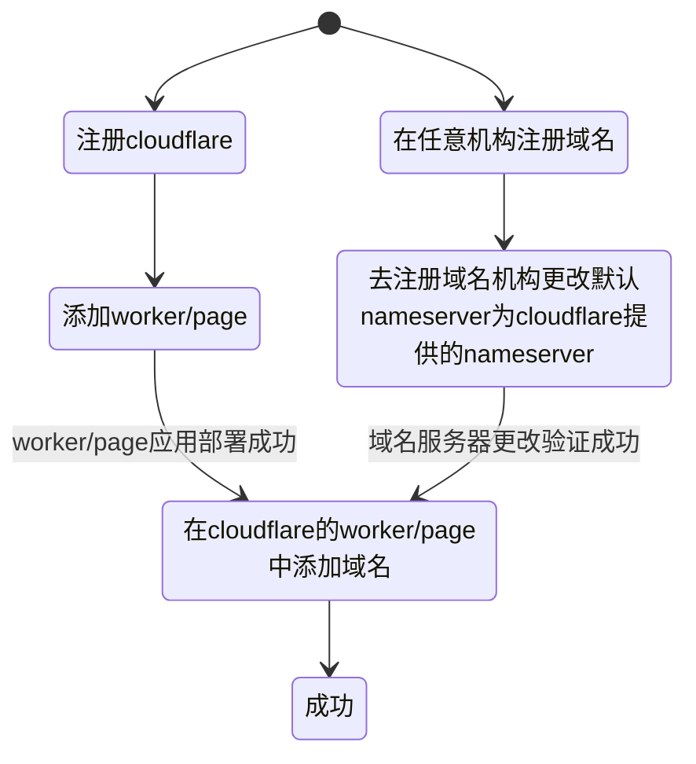

<h1 align="center">
    <br>
    部署指南
    <br>
</h1>
<div align="center">

一键部署至render   
[](https://render.com/deploy?repo=https://github.com/beidongjiedeguang/openai-forward)


[pip部署](#pip部署) |
[docker部署](#docker部署) |
[render一键部署](#render-一键部署) |
[railway一键部署](#railway-一键部署) |
[cloudflare部署](#cloudflare-部署) |
[Vercel一键部署](#Vercel-一键部署) 

</div>

本文档中提供以下几种部署方式  
**本地部署**

1. [pip 安装部署](deploy.md#pip部署)
2. [Docker部署](deploy.md#docker部署)

**一键免费云平台部署**

1. [Render一键部署](deploy.md#render-一键部署)
2. [Railway部署](deploy.md#Railway-一键部署)

---
下面的部署仅包含反向代理功能

3. [一键Vercel部署](deploy.md#vercel-一键部署)
4. [cloudflare部署](deploy.md#cloudflare-部署)

## pip部署

**安装**

```bash
pip install openai-forward
```

**运行服务**  

```bash
aifd run   
```
服务就搭建完成了。  
配置见[配置](README.md#配置)

### 服务调用

使用方式只需将`https://api.openai.com` 替换为服务所在端口`http://{ip}:{port}`   
如
```bash
# 默认
https://api.openai.com/v1/chat/completions
#替换为
http://{ip}:{port}/v1/chat/completions
```

更多使用方式见 [应用](README.md#应用)

### 开启SSL (以https访问域名)
首先准备好一个域名, 如本项目中使用的域名为`api.openai-forward.com`

常用方式是使用nginx(不习惯用命令行配置的话可以考虑用 [Nginx Proxy Manager](https://github.com/NginxProxyManager/nginx-proxy-manager), 它可方便设置Let's Encrypt证书自动申请和自动续期) 代理转发 openai-forward 服务端口(默认8000)。  
需要注意的是，若要使用流式转发，在nginx配置中需要添加关闭代理缓存的配置, 即在Nginx Proxy Manager的 Custom Nginx Configuration中写入：
```bash
proxy_buffering off;
```
 

**Q**: 使用Nginx 或 Nginx Proxy Manager可以直接对任何api进行转发，为什么要用这个库？  
**A**: `openai-forward`的转发代理功能只是一项基础功能，它的日志记录、token速率限制、自定义秘钥等功能都是nginx无法直接做到的。

<a>
   
</a>

## Docker部署

```bash
docker run -d -p 9999:8000 beidongjiedeguang/openai-forward:latest 
```

将映射宿主机的9999端口，通过`http://{ip}:9999`访问服务。  
容器内日志路径为`/home/openai-forward/Log/`, 可在启动时将其映射出来。  

注：同样可以在启动命令中通过-e传入环境变量OPENAI_API_KEY=sk-xxx作为默认api key  
启用SSL同上.
环境变量配置见[环境变量配置](README.md#环境变量配置项)


## 源码部署

```bash
git clone https://github.com/beidongjiedeguang/openai-forward.git --depth=1
cd openai-forward

pip install -e .
aifd run 
```
启用SSL同上.


<a>
   
</a>

## Render 一键部署
[](https://render.com/deploy?repo=https://github.com/beidongjiedeguang/openai-forward)

Render应该算是所有部署中最简易的一种, 并且它生成的域名国内可以直接访问！

1. 点击一键部署按钮  
   也可先fork本仓库 -->到Render的Dashboard上 New Web Services --> Connect 到刚刚fork到仓库 后面步骤均默认即可
2. 填写环境变量，`openai-forward`所有配置都可以通过环境变量设置，可以根据自己需要填写。

然后等待部署完成即可。  
Render的免费计划: 每月750小时免费实例时间(意味着单个实例可以不间断运行)、100G带宽流量、500分钟构建时长.

注：默认render在15分钟内没有服务请求时会自动休眠(好处是休眠后不会占用750h的免费实例时间)，休眠后下一次请求会被阻塞 5~10s。
如果希望服务15分钟不自动休眠，可以使用定时脚本（如每14分钟）去请求服务进行保活。保活脚本参考`scripts/keep_render_alive.py`.    
如果希望零停机部署可以在设置中设置`Health Check Path`为`/healthz`   

> https://render.openai-forward.com  
> https://openai-forward.onrender.com 


<a>
   
</a>

## Railway 一键部署
[](https://railway.app/template/tejCum?referralCode=U0-kXv)

1. 点击上面部署按钮进行一键部署  
   也可先fork本仓库，再手动在操作界面导入自己的fork项目
2. 填写环境变量，必填项`PORT` :`8000`, 可选项 如默认的OPENAI_API_KEY 等
3. 绑定自定义域名

注： Railway 每月提供 $5.0和500小时执行时间的免费计划。这意味着单个免费用户每个月只能使用大约21天


<a>
   
</a>


⚠️下面两种部署方式仅提供简单的转发服务，没有任何额外功能。  
适合只有简单需求的用户(国内访问openai api服务)。

## Vercel 一键部署

[](https://vercel.com/new/clone?repository-url=https%3A%2F%2Fgithub.com%2Fbeidongjiedeguang%2Fopenai-forward&project-name=openai-forward&repository-name=openai-forward&framework=other)  
因python的部署方式在vercel上存在诸多限制，因此现在将Vercel部署方式切换为直接代理转发，而没有其它功能。

1. 点击按钮即可一键免费部署  
   也可先fork本仓库，再手动在vercel操作界面import项目
2. [绑定自定义域名](https://vercel.com/docs/concepts/projects/domains/add-a-domain)：Vercel 分配的DNS在某些区域被污染了导致国内无法访问，绑定自定义域名即可直连。


<a>
   
</a>

## Cloudflare 部署

部署方式二选一：
* Pages部署: fork本仓库，在[cloudflare](https://dash.cloudflare.com/)上创建应用程序时选择Pages, 然后选择连接到Git, 选择刚刚fork的仓库即可完成部署。
* Workers部署: 在[cloudflare](https://dash.cloudflare.com/)上创建应用程序时选择Workers, 部署好示例代码后，点击快速修改（quick edit）复制[_worker.js](_worker.js) 至代码编辑器即可完成服务部署。

绑定自定义域名: **目前Pages部署时cloudflare自动分配的域名国内可以直接访问**, 而Workers部署时分配的则绑定自定义域名国内才可访问. 

绑定自定义域名需要将域名默认nameserver(域名服务器)绑定到cloudflare提供的nameserver，大体上过程是：

这种部署方式轻便简洁，支持流式转发. 不过目前[_worker.js](_worker.js)这个简单脚本仅提供转发服务, 不支持额外功能。

> https://openai-forward-9ak.pages.dev (这是cloudflare pages自动分配的域名，目前可以直接访问)
